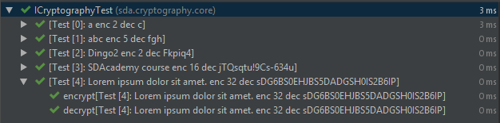
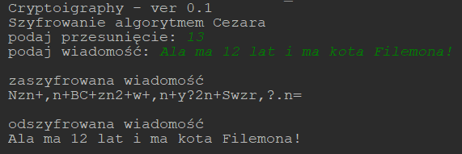

# SDA - cryptography

Projekt z zajęć z programowania średnio zaawansowanego

implementacja prostego szyfrującego algorytmu Cezara. 
algorytm oparty jest na zdefiniowanej tablicy znaków, na której pracuje sam algorytm.
Znaki które nie są zawarte w algorytmie są wstawiane jak są. 
W przypadku kiedy dany znak się znajduje w tablicy, przesówamy się 
o zadaną ilość pól tablicy. 

## testy

## aplikacja

